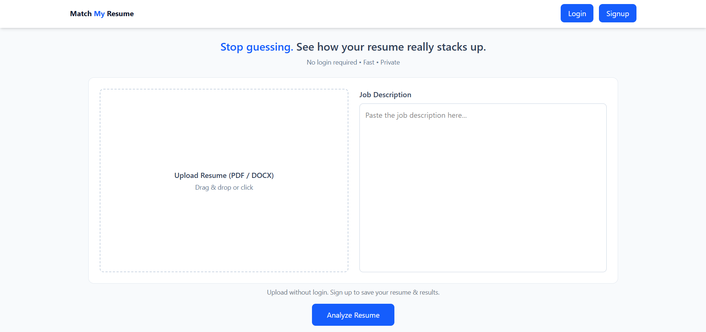
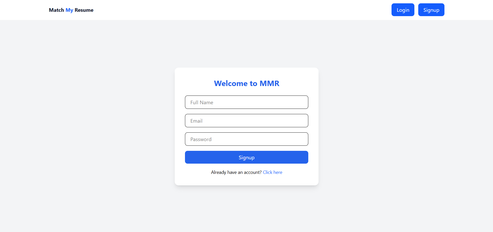
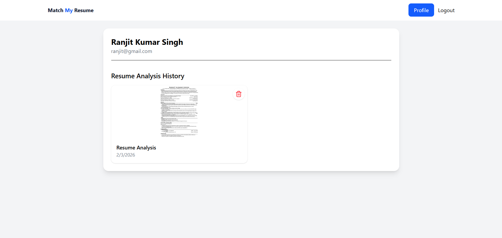
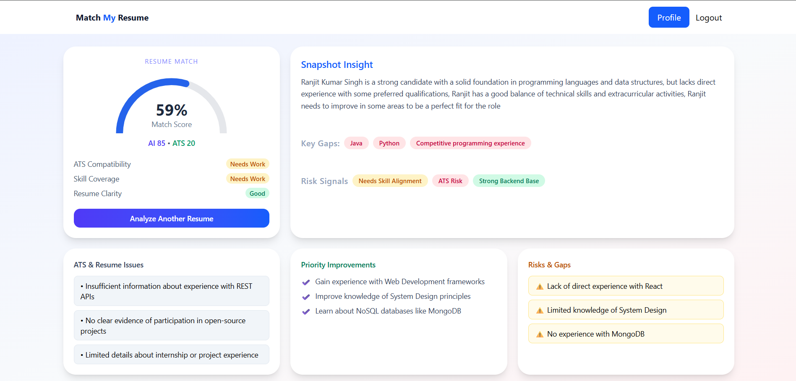
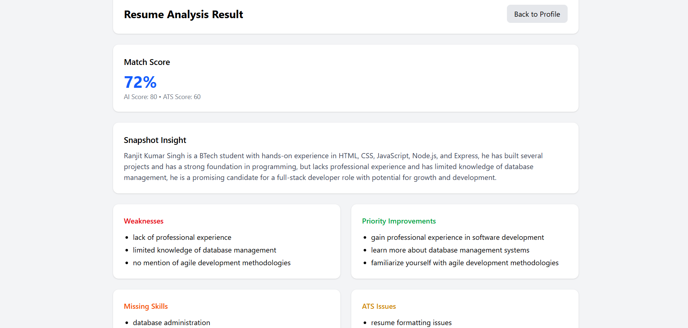
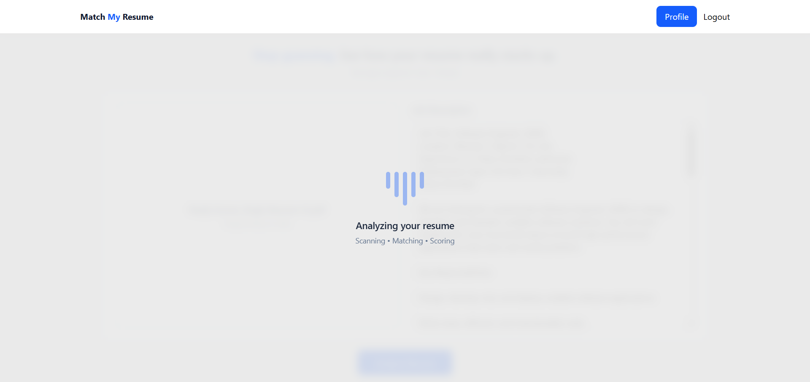

# 🔍 Match My Resume (MMR)

**Stop guessing. See how your resume really stacks up.**

Match My Resume is an **AI-powered resume analysis platform** that evaluates resumes against job descriptions, identifies ATS gaps, highlights missing skills, and delivers **clear, actionable recommendations** to dramatically improve shortlisting chances.

🌐 **Live Demo**  
👉 https://matchmyresume-frontend.onrender.com  

---

## 🚀 What Problem Does It Solve?

Most resumes fail *before* a recruiter ever sees them.

- ❌ ATS keyword mismatches  
- ❌ Poor skill alignment  
- ❌ Weak resume clarity  
- ❌ No idea what to improve  

**MMR fixes this by acting like a smart recruiter + ATS combined.**

---

## 🧠 Core Features

### 📄 Resume & Job Description Analysis
- Upload resumes (PDF / DOCX)
- Paste any job description
- AI-powered semantic matching

### 📊 Smart Match Scoring
- Overall Resume Match %
- AI Skill Alignment Score
- ATS Compatibility Score

### 🔍 Deep Resume Insights
- Snapshot candidate summary
- Strengths & weaknesses
- Missing & underrepresented skills
- ATS formatting issues
- Hiring risk signals

### 🎯 Priority Improvements
- What to fix **first**
- Skills to add for higher JD alignment
- Resume improvements with maximum impact

### 👤 User Accounts & History
- Secure authentication
- Resume analysis history
- Re-analyze or delete past reports

---

## 🖼️ Product Screenshots

> All screenshots are taken from the live application.

### 🏠 Landing Page – Resume Upload & JD Input

### 🔐 Signup Page

### 👤 Profile Dashboard & Resume History

### 📈 Resume Analysis Result

### 🚨 ATS Issues, Risks & Priority Fixes

### ⏳ Resume Analysis Processing State

---

## 🧩 Tech Stack & Skills

### 🌐 Frontend Engineering
- **React.js** – component-based UI architecture
- **Tailwind CSS** – responsive, utility-first styling
- **JavaScript (ES6+)**
- **Axios** – secure API communication
- **Modern UI/UX principles**
- **Reusable & scalable component design**

### ⚙️ Backend Engineering
- **Node.js** – server-side runtime
- **Express.js** – RESTful API development
- **JWT Authentication** – secure user sessions
- **Middleware-based architecture**
- **Role-based & protected routes**

### 🧠 AI / Resume Intelligence
- Resume parsing & text extraction
- Skill identification & normalization
- ATS keyword matching algorithms
- Job-resume semantic similarity scoring
- Risk signal detection
- Rule-based + AI-enhanced analysis logic

### 🔐 Security & Performance
- Secure authentication flow
- Token-based authorization
- Protected APIs
- Input validation & error handling

### 🧰 Developer Tools & Practices
- Git & GitHub (version control)
- Modular code structure
- Clean architecture principles
- Production-ready folder structure
- Debugging & optimization mindset

---

## 🔐 Privacy & Security

- No resumes are publicly accessible
- Resume data is tied to authenticated users
- Secure JWT-based sessions
- Option to analyze resumes without login

---

## ⚙️ How It Works

1. Upload your resume  
2. Paste the job description  
3. Click **Analyze Resume**  
4. Instantly receive:
   - Match Score
   - ATS Score
   - Missing Skills
   - Resume Risks
   - Clear improvement roadmap

**No guessing. Just clarity.**

---

## 🎯 Ideal Use Cases

- 🎓 Students applying for internships
- 👨‍💻 Developers targeting specific roles
- 🔁 Job switchers optimizing resumes
- 🧑‍💼 Recruiters checking candidate fit
- 🚀 Anyone tired of silent rejections

---

## 🔮 Planned Enhancements

- AI-powered resume rewriting
- JD-specific resume suggestions
- Skill-gap learning roadmap
- ATS-optimized resume export
- Chrome extension

---

## 👨‍💻 Author

**Ranjit Kumar Singh**  
Electronics & Communication Engineering Undergraduate  
Full-Stack Developer | DSA | System Design | AI-powered Products  

---

## ⭐ Support the Project

If this project helped you:
- ⭐ Star the repository  
- 🔁 Share with peers  
- 🚀 Use it to beat ATS filters  

**Built to help resumes get noticed.**
